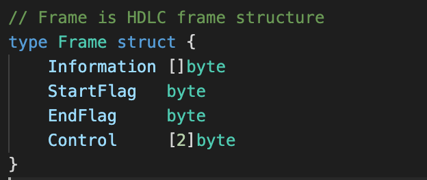
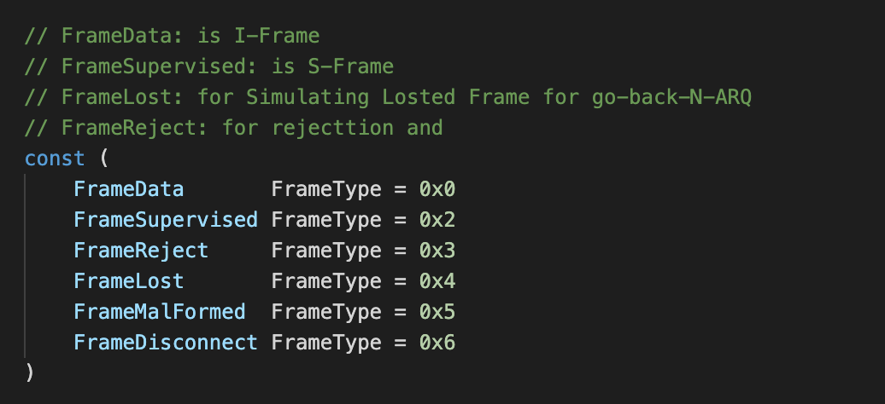
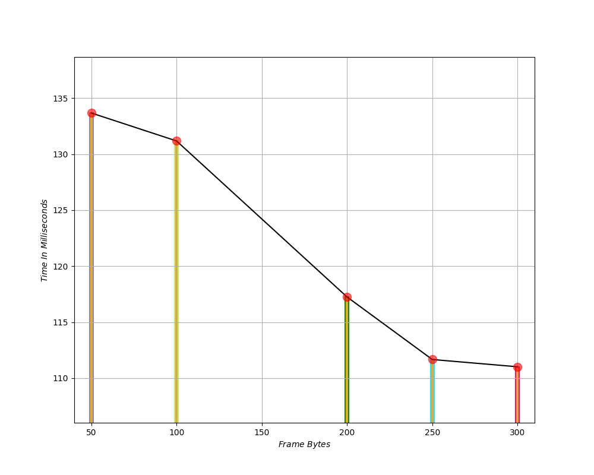
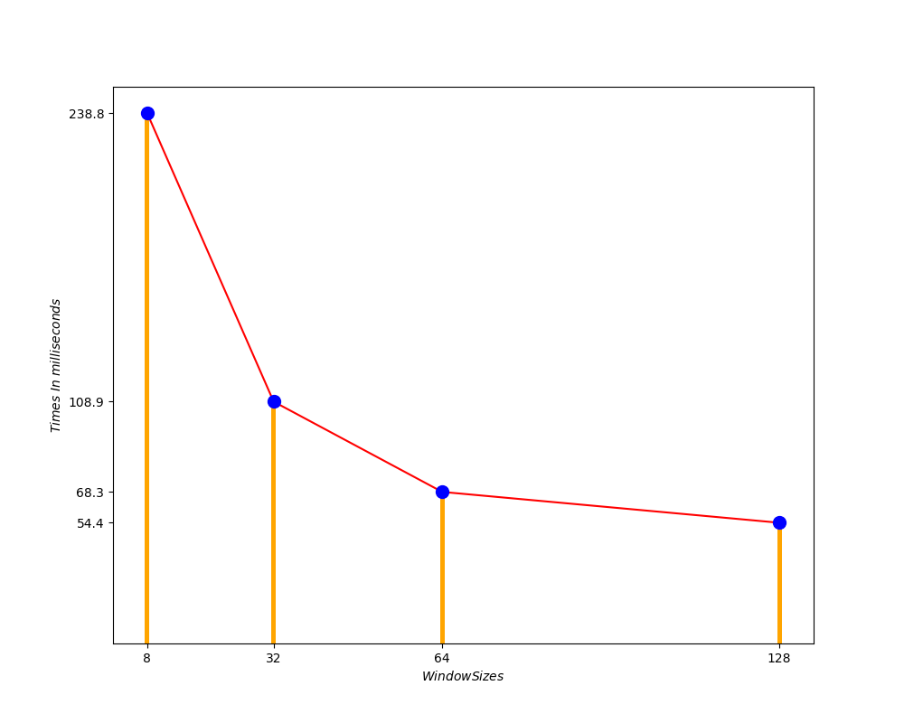

# DATA-LINK-PROTOCOL
This Project Is a Simple Implementation Of [HDLC](https://en.wikipedia.org/wiki/High-Level_Data_Link_Control) And  [Go-Back-ARQ Protocol](https://en.wikipedia.org/wiki/Go-Back-N_ARQ), Which Is Written In Golang Using [TCP](https://golang.org/pkg/net) Socket.

## Frame Structure
* structure:
    - Information: which hold information of frames (it depeneds on frame length)
    - StartFlag: for distinguishing the start of frame (1 byte)
    - EndFlag: for distinguishing the end of frame (1 byte)
    - Control: for holding the sequence number and address (2 byte)
    
## Frame Types
* types:
    - FrameData: for sending information frame
    - FrameSupervised: for sending acknowledge frames
    - FrameReject: for sending rejected acknowledge frames
    - FrameDisconnect: for disconnecting the connection
    
## Start
```bash 
    (running server)
    cd server
        go run server.go pass window size
    
    (running client)
    cd client
        go run client.go pass frame length
    
    (running with python)
    python3 -m venv env
        source env/bin/activate 
            (env) python runner.py
```

## Screenshots
* Different Frame Length
    

* Performance Different Windows Sizes
    
